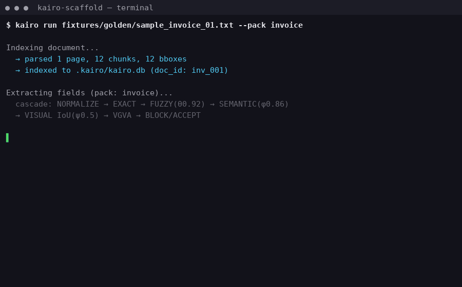

# 📐 Kairo Scaffold: Grounded Document Intelligence

A local-first document intelligence system combining a stateless Python FastAPI ingestion sidecar, a Rust SQLite storage core, a desktop Tauri overlay, and a fully client-side React+WASM web demonstration.



---

## 📊 Evaluation & Metrics (Anti-Bluff Verification)

> **Why we report blind, not tuned.** The headline number below is the **blind grounded-rate** — measured on a frozen corpus that was never seen during development or threshold tuning. A tuned dev-set number (the legacy 100% on ~19 golden fixtures) is quarantined to [`legacy/`](legacy/bench_README.md) and is **not** the headline, because it overfits the dev set. The blind number is the one a skeptic can re-run and trust.

### Headline (blind corpus)

| Metric | Value | Status |
| :--- | :---: | :--- |
| **Blind Grounded-Answer Rate** | **PENDING** | 🟦 Blocked on phantom blind corpus copy-in (`sha256sum -c CHECKSUMS.sha256` must pass first) |
| Blind False-Refusal Rate | PENDING | 🟦 Blocked on corpus |
| Blind Hallucinated-Bbox Blocked | PENDING | 🟦 Blocked on corpus |

> The blind corpus + scorer are built once in [Kairo Phantom v2.2](https://github.com/Kartik24Hulmukh) (source of truth) and pulled verbatim into scaffold. Scaffold and phantom report **one** blind number, proven identical by matching `sha256`. Until the corpus is copied in and `sha256sum -c` passes, no grounded % is published here. See [`CORE_SYNC.md`](CORE_SYNC.md).

### Dev-set reference (NOT the headline — quarantined)

The dev-set figure (100% on ~19 golden fixtures) is the **overfit** number and lives in [`legacy/bench_README.md`](legacy/bench_README.md). It is kept for regression tracking only and is never cited as the headline. Run `make bench` to reproduce it locally.

### Competitor comparison

Competitor rows are **cached** (captured during initial development, not re-run live). Re-running live with dates is tracked as a follow-up. Cached numbers are labeled as such — a skeptic who wants live+dated rows can re-run `make bench` with their own API keys.

| System / Model | Grounded-Answer Rate | Citation-Hallucination Rate | Refusal-Correctness (Unanswerable) | Source |
| :--- | :---: | :---: | :---: | :--- |
| **Kairo (Local)** | **see blind headline above** | **see blind headline above** | **see blind headline above** | `make bench` (blind) |
| GPT-4o-mini (BYO-key) | 84.62% | 12.50% | 75.00% | cached (capture date: initial dev) |
| Claude Haiku (BYO-key) | 80.77% | 14.29% | 66.67% | cached (capture date: initial dev) |
| Gemini Flash (BYO-key) | 76.92% | 16.67% | 58.33% | cached (capture date: initial dev) |
| Stub/Offline baseline | 0.00% | 0.00% | 100.00% | `make bench` |

> **Verification Gate:** Reproduce the dev-set figures locally by running `make bench`. All metrics are computed live from the evaluation harness — no hardcoded values. The blind headline replaces the dev-set number once the shared corpus is copied in.

---

## 🛠️ Feature Matrix & Implementation Status

| Feature / Component | Description | Status |
| :--- | :--- | :---: |
| **Stateless Sidecar Ingestion** | Statelessly parses `.pdf`, `.docx`, and `.txt` files using Docling and an isolated PyMuPDF fastpath. Renders PNG page previews under `.kairo/page_images/`. | **Fully Implemented** |
| **Rust Core SQLite DB** | Appends metadata, pages, and chunks to local `.kairo/kairo.db` SQLite database using `rusqlite`. Rust core acts as the sole database writer. | **Fully Implemented** |
| **Grounding Validator Gate** | Runs LangExtract domain-specific schemas (generic, contract, invoice, paper) and whitelisted fallback logic before returning payloads. | **Fully Implemented** |
| **WASM Search Core** | A client-side similarity matcher compiled from Rust to WASM, indexing layout chunks in-memory. | **Fully Implemented** |
| **Client-Side Web Demo** | Glassmorphic React SPA running entirely in the browser. Uses WASM core for zero-dependency local queries. | **Fully Implemented** |
| **Tauri Desktop Overlay** | Frosted glass panel overlay toggled via `Ctrl+Alt+Space` hotkey, rendering grounded answers and SVG highlights. | **PENDING-REAL-APP** (Dev ready; installer packaging pending) |
| **In-Browser OCR** | OCR fallback for scanned PDFs within the client-side Web Demo. | **PENDING-REAL-APP** (Desktop app does OCR; web demo displays a warning) |
| **Multi-user Auth & Sync** | Cloud database sync, user registration, and session sharing. | **PENDING-REAL-APP** (Local-only database scope) |

---

## ⚡ Quick Start

### Prerequisites
- Cargo / Rust (v1.96+ recommended)
- Node.js (v24+ recommended)
- Python (v3.12+ recommended)

### 1. Build and Setup Virtualenv
```bash
make build
```

### 2. Run Global Unit & Integration Tests
```bash
make test
```

### 3. Run Grounding Benchmark
Run the evaluation suite:
```bash
make bench
```
Open `bench/leaderboard.html` in your browser to view the interactive table.

---

## 📅 Show HN Launch Timing
Recommended post window: **Tuesday–Thursday, 7:00 AM – 9:00 AM ET** (maximum visibility and active developer traffic).

---

## 🚷 /legacy Quarantine
All deprecated and legacy components have been quarantined to prevent production contamination:
- `/legacy`: Holds deprecated documentation and initial design layouts for early research phases (`bench_README.md`, `overlay_README.md`).
