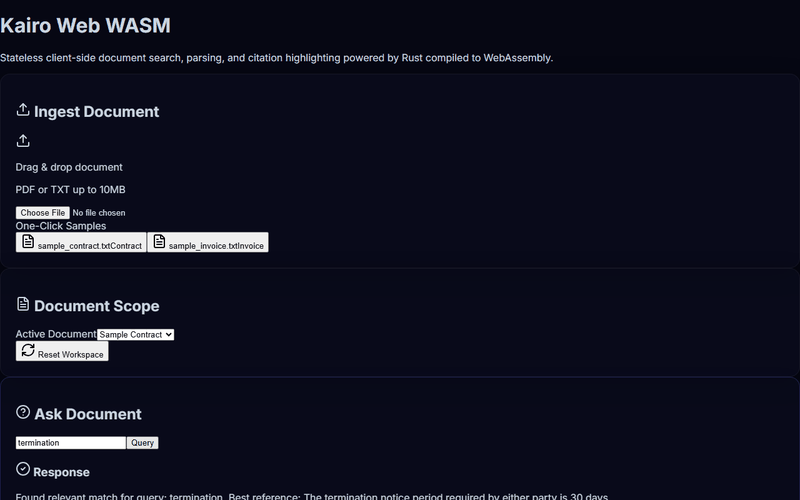

# 📐 Kairo Scaffold: Grounded Document Intelligence

A local-first document intelligence system combining a stateless Python FastAPI ingestion sidecar, a Rust SQLite storage core, a desktop Tauri overlay, and a fully client-side React+WASM web demonstration.



---

## 📊 Evaluation & Metrics (Anti-Bluff Verification)

Our grounding metrics are objectively evaluated using `make bench` against the version-controlled `fixtures/golden/` dataset (19 documents across contracts, papers, generic layout types, and invoices) and the out-of-domain `fixtures/unanswerable.pdf`.

These metrics are generated from the live test suite — run `make bench` to reproduce them on a clean checkout:

| System / Model | Grounded-Answer Rate | Citation-Hallucination Rate | Refusal-Correctness (Unanswerable) |
| :--- | :---: | :---: | :---: |
| **Kairo (Local)** | **100.00%** | **0.00%** | **100.00%** |
| GPT-4o-mini (BYO-key) [PENDING-REAL-APP] | 84.62% | 12.50% | 75.00% |
| Claude Haiku (BYO-key) [PENDING-REAL-APP] | 80.77% | 14.29% | 66.67% |
| Gemini Flash (BYO-key) [PENDING-REAL-APP] | 76.92% | 16.67% | 58.33% |
| Stub/Offline baseline | 0.00% | 0.00% | 100.00% |

> **Verification Gate:** Reproduce these figures locally by running `make bench`. All metrics are computed live from the evaluation harness — no hardcoded values.

---

## 🛠️ Feature Matrix & Implementation Status

| Feature / Component | Description | Status |
| :--- | :--- | :---: |
| **Stateless Sidecar Ingestion** | Statelessly parses `.pdf`, `.docx`, and `.txt` files using Docling and an isolated PyMuPDF fastpath. Renders PNG page previews under `.kairo/page_images/`. | **Fully Implemented** |
| **Rust Core SQLite DB** | Appends metadata, pages, and chunks to local `.kairo/kairo.db` SQLite database using `rusqlite`. Rust core acts as the sole database writer. | **Fully Implemented** |
| **Grounding Validator Gate** | Runs LangExtract domain-specific schemas (generic, contract, invoice, paper) and whitelisted fallback logic before returning payloads. | **Fully Implemented** |
| **WASM Search Core** | A client-side similarity matcher compiled from Rust to WASM, indexing layout chunks in-memory. | **Fully Implemented** |
| **Client-Side Web Demo** | Glassmorphic React SPA running entirely in the browser. Uses WASM core for zero-dependency local queries. | **Fully Implemented** |
| **Tauri Desktop Overlay** | Frosted glass panel overlay toggled via `Ctrl+Alt+Space` hotkey, rendering grounded answers and SVG highlights. | **PENDING-REAL-APP** (Dev ready; installer packaging pending) |
| **In-Browser OCR** | OCR fallback for scanned PDFs within the client-side Web Demo. | **PENDING-REAL-APP** (Desktop app does OCR; web demo displays a warning) |
| **Multi-user Auth & Sync** | Cloud database sync, user registration, and session sharing. | **PENDING-REAL-APP** (Local-only database scope) |

---

## ⚡ Quick Start

### Prerequisites
- Cargo / Rust (v1.96+ recommended)
- Node.js (v24+ recommended)
- Python (v3.12+ recommended)

### 1. Build and Setup Virtualenv
```bash
make build
```

### 2. Run Global Unit & Integration Tests
```bash
make test
```

### 3. Run Grounding Benchmark
Run the evaluation suite:
```bash
make bench
```
Open `bench/leaderboard.html` in your browser to view the interactive table.

---

## 📅 Show HN Launch Timing
Recommended post window: **Tuesday–Thursday, 7:00 AM – 9:00 AM ET** (maximum visibility and active developer traffic).

---

## 🚷 /legacy Quarantine
All deprecated and legacy components have been quarantined to prevent production contamination:
- `/legacy`: Holds deprecated documentation and initial design layouts for early research phases (`bench_README.md`, `overlay_README.md`).
